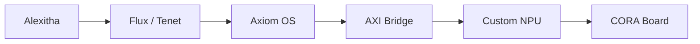

# CORA

Core Operating & Reasoning Appliance

CORA is Axiom Lab's hardware appliance for sovereign, verifiable AI computation. It combines a custom NPU architecture, Axiom OS, Flux, and Alexitha into a single air-gapped system designed for mathematical reasoning and zero-cloud execution.

CORA is the hardware and silicon home for the Axiom stack.

Concept render showing the enclosure direction, board layout language, and multi-view hardware presentation for CORA.

## What CORA Is

CORA is not a generic AI workstation and it is not a rented GPU endpoint in a box. It is intended as a tightly integrated reasoning appliance where the software stack and the hardware execution model are designed together.

At a high level, CORA brings together:

- `Axiom OS` as the operating environment
- `Flux` as the math-native programming language
- `Tenet` as the strategic and verification layer
- `Alexitha` as the native reasoning model
- a custom NPU architecture built around FPGA-based prototyping and future custom hardware

## System Overview

In practice, the reasoning stack flows from model and language layers down into a dedicated execution path:

- `Alexitha` produces reasoning workloads
- `Flux` and `Tenet` structure, constrain, and dispatch computation
- `Axiom OS` orchestrates runtime execution
- the `AXI bridge` moves data between software and programmable logic
- the `NPU` executes the math-heavy path
- the `CORA board` is the physical appliance that houses the system

See also: [docs/system-overview.md](docs/system-overview.md)

## What This Repo Is

This repository is the hardware and system-design home for CORA. It is focused on the appliance itself: architecture, product framing, board direction, physical design language, and the execution model that ties software to hardware.

If Axiom Lab is the umbrella and Flux, Tenet, and Alexitha are the software layers, CORA is the machine those ideas are ultimately meant to inhabit.

## Why It Exists

Most AI systems are assembled from layers that were never designed for formal reasoning or verifiable execution. CORA takes the opposite approach: build a system where the reasoning language, execution environment, and hardware constraints reinforce each other.

The goal is not just speed. The goal is control, inspectability, and a stack whose behavior can be reasoned about from the software layer down to the silicon.

See also: [docs/why-not-gpu-cloud.md](docs/why-not-gpu-cloud.md)

## Hardware Direction

The current prototype direction is centered on the Xilinx Zynq-7000 SoC:

- ARM processing system for orchestration and OS execution
- FPGA fabric for the NPU logic
- AXI interconnect for low-overhead communication between software and hardware
- custom carrier-board work for a distinct CORA physical design

The long-term design language is a visible, brutalist appliance:

- matte-black carrier board
- exposed ENIG traces
- acrylic enclosure
- dedicated HDMI terminal output
- minimal external I/O

See also: [docs/design-language.md](docs/design-language.md)

## Repository Structure

- `docs/` - product framing, architecture notes, design language, and legacy documentation
- `hardware/` - KiCad board files and hardware artifacts
- `renders/` - concept imagery and visual presentation assets
- `sim/` - simulation and demo artifacts

## Key Docs

- [docs/system-overview.md](docs/system-overview.md) - fast architectural orientation
- [docs/hardware-status.md](docs/hardware-status.md) - current state of the hardware effort
- [docs/pcb-design.md](docs/pcb-design.md) - PCB design direction, components, and KiCad workflow
- [docs/enclosure-cad.md](docs/enclosure-cad.md) - 3D CAD direction, materials, dimensions, and thermal concerns
- [docs/design-language.md](docs/design-language.md) - transparent monolith concept and physical philosophy
- [docs/process-overview.md](docs/process-overview.md) - high-level phase map for the full CORA build effort
- [docs/why-not-gpu-cloud.md](docs/why-not-gpu-cloud.md) - the contrarian thesis behind CORA
- [docs/research-paper-ideas.md](docs/research-paper-ideas.md) - paper roadmap and venue strategy
- [docs/migration.md](docs/migration.md) - naming and repo-structure migration notes
- [docs/CORA_PRD.md](docs/CORA_PRD.md) - product requirements and positioning
- [docs/CORA.md](docs/CORA.md) - long-form hardware narrative and project framing
- [docs/CORA_CARRIER_ARCHITECTURE.md](docs/CORA_CARRIER_ARCHITECTURE.md) - carrier-board and system architecture notes
- [docs/CORA_ARCHITECTURAL_DIAGRAMS.md](docs/CORA_ARCHITECTURAL_DIAGRAMS.md) - diagrams and logic blueprints
- [docs/CORA_MATH.md](docs/CORA_MATH.md) - engineering calculations and constraints

## Position in the Axiom Stack

| Layer | Component | Role |
|---|---|---|
| Application Logic | Flux / Tenet | Structured reasoning and verified computation |
| Model Layer | Alexitha | Native reasoning engine |
| OS Layer | Axiom OS | Appliance runtime and device control |
| Interconnect | AXI Bridge | Software-to-hardware data path |
| Hardware Layer | CORA | Dedicated execution appliance |

## Relationship To Axiom Lab

CORA is a project inside the broader Axiom Lab stack, but this repo should read as a product and hardware repo first.

For the broader umbrella view, see:

- Axiom Lab: https://github.com/fawazishola/Axiom-Lab
- Flux: https://github.com/fawazishola/Flux
- Tenet: https://github.com/fawazishola/Tenet
- Alexitha: https://github.com/fawazishola/Alexitha

## Current Status

CORA is in active architecture and prototyping mode. The repo already contains the product framing, hardware direction, and board-design groundwork, but the project is still evolving from research hardware into a unified appliance.

The hardware effort is still in ideation and team-formation mode. The direction is clear, but the full build program is still being assembled around design, hardware execution, and system integration.

## License

MIT. See [LICENSE](LICENSE).
