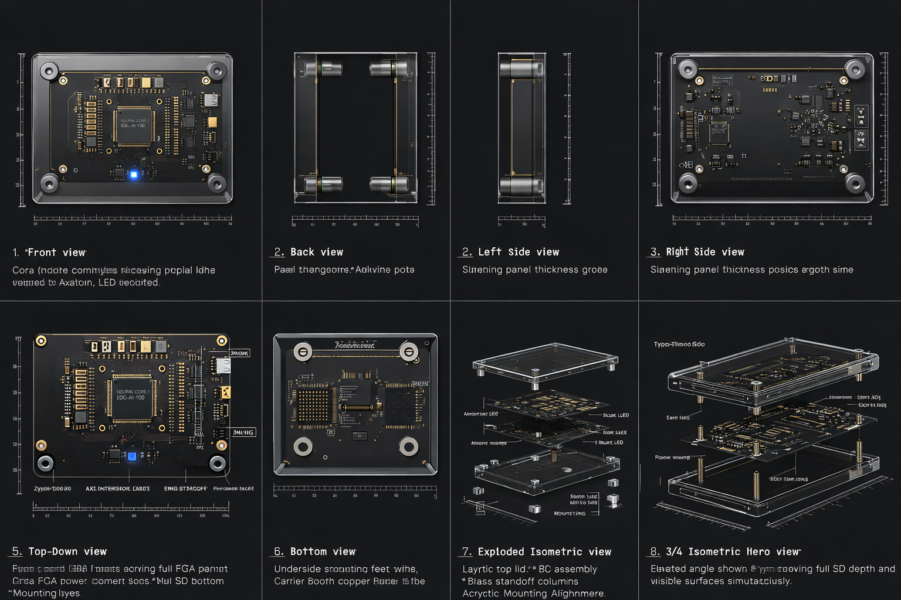

# CORA

Core Operating & Reasoning Appliance

CORA is Axiom Lab's hardware appliance for sovereign, verifiable AI computation. It combines a custom NPU architecture, Axiom OS, Flux, and Alexitha into a single air-gapped system designed for mathematical reasoning and zero-cloud execution.

Originally, the project was developed under the name `SIERRA` (Symbolic Intelligence Engine for Reasoning & Recursive Architecture). That name still appears in legacy architecture documents and board files across this directory.

Concept render showing the enclosure direction, board layout language, and multi-view hardware presentation for CORA.

## What CORA Is

CORA is not a generic AI workstation and it is not a rented GPU endpoint in a box. It is intended as a tightly integrated reasoning appliance where the software stack and the hardware execution model are designed together.

At a high level, CORA brings together:

- `Axiom OS` as the operating environment
- `Flux` as the math-native programming language
- `Tenet` as the strategic and verification layer
- `Alexitha` as the native reasoning model
- a custom NPU architecture built around FPGA-based prototyping and future custom hardware

## What This Repo Is

This repository is the hardware and system-design home for CORA. It is focused on the appliance itself: architecture, product framing, board direction, and the physical execution model.

If Axiom Lab is the umbrella and Flux/Tenet/Alexitha are the software layers, CORA is the machine those ideas are ultimately meant to inhabit.

## Why It Exists

Most AI systems are assembled from layers that were never designed for formal reasoning or verifiable execution. CORA takes the opposite approach: build a system where the reasoning language, execution environment, and hardware constraints reinforce each other.

The goal is not just speed. The goal is control, inspectability, and a stack whose behavior can be reasoned about from the software layer down to the silicon.

## Hardware Direction

The current prototype direction is centered on the Xilinx Zynq-7000 SoC:

- ARM processing system for orchestration and OS execution
- FPGA fabric for the NPU logic
- AXI interconnect for low-overhead communication between software and hardware
- custom carrier-board work for a distinct CORA physical design

The long-term design language is a visible, brutalist appliance:

- matte-black carrier board
- exposed ENIG traces
- acrylic enclosure
- dedicated HDMI terminal output
- minimal external I/O

## Repository Contents

This repository contains the hardware and architecture material for CORA:

- [CORA_PRD.md](CORA_PRD.md) - product requirements and positioning
- [SIERRA.md](SIERRA.md) - legacy long-form hardware narrative from the original naming
- [SIERRA_CARRIER_ARCHITECTURE.md](SIERRA_CARRIER_ARCHITECTURE.md) - carrier-board and system architecture notes
- [SIERRA_ARCHITECTURAL_DIAGRAMS.md](SIERRA_ARCHITECTURAL_DIAGRAMS.md) - diagrams and logic blueprints
- [SIERRA_MATH.md](SIERRA_MATH.md) - engineering calculations and constraints
- KiCad project files for the carrier board and related hardware work

## Position in the Axiom Stack

| Layer | Component | Role |
|---|---|---|
| Application Logic | Flux / Tenet | Structured reasoning and verified computation |
| Model Layer | Alexitha | Native reasoning engine |
| OS Layer | Axiom OS | Appliance runtime and device control |
| Hardware Layer | CORA | Dedicated execution appliance |

## Relationship To Axiom Lab

CORA is a project inside the broader Axiom Lab stack, but this repo should read as a product and hardware repo first.

For the broader umbrella view, see:

- Axiom Lab: https://github.com/fawazishola/Axiom-Lab
- Flux: https://github.com/fawazishola/Flux
- Tenet: https://github.com/fawazishola/Tenet
- Alexitha: https://github.com/fawazishola/Alexitha

## Current Status

CORA is in active architecture and prototyping mode. The repo already contains the product framing, hardware direction, and board-design groundwork, but the project is still evolving from research hardware into a unified appliance.

## Notes

- When you see `SIERRA` in filenames, read it as historical naming unless the file is explicitly about the older branding.
- If you want the naming fully normalized later, we can do a second pass across the `sierra/` directory and update legacy docs more broadly.
