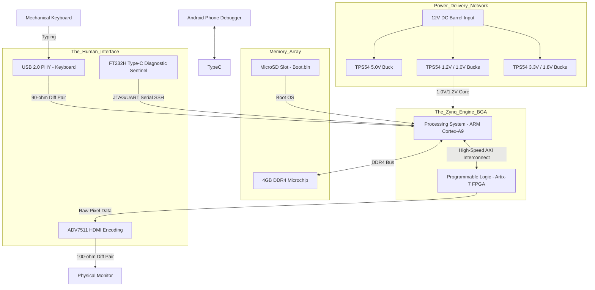
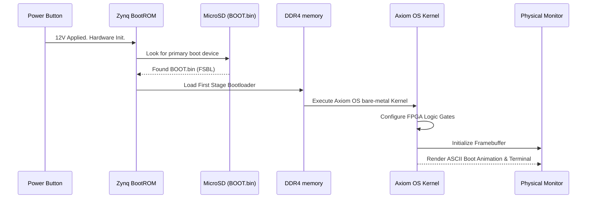
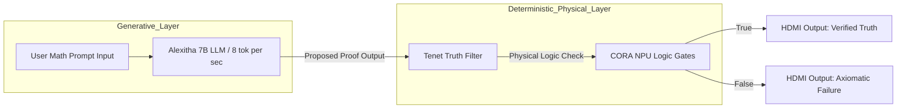

# CORA NPU: Architectural & Logic Blueprints

This document holds the core architectural logic diagrams that define the flow of the CORA native hardware and the Axiom OS stack.

## 1. The Physical Monolith Architecture
This diagram illustrates how the hardware subsystems on the custom BGA PCB route logic from the raw silicon to the human interface.

## 2. The Axiom OS Boot Sequence (Bare-Metal)
How the custom Axiom OS fundamentally powers on without a generic BIOS.

## 3. The Neurosymbolic Data Flow
How Alexitha generates a proof and the physical NPU verifies it mathematically.

